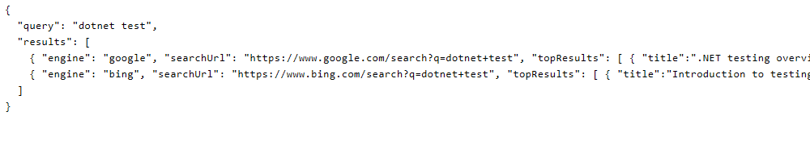

AgentMcp - .NET minimal MCP server

Endpoints:
- GET /keepalive -> returns 200 OK { "status": "ok" }
- GET /web_search?query=... -> queries multiple search engines (google, bing, duckduckgo, yahoo, startpage) and returns a JSON object containing per-engine top results for AI consumption.

Notes:
- This project uses HtmlAgilityPack to extract top results when official APIs are not configured.
- For production reliability use official search APIs (SerpAPI, Bing Search API, Google Custom Search) and configure API keys.
- To run locally: dotnet run (requires .NET 7 SDK)

## Test screenshots (simulated)

The runtime was not available in the environment, so these screenshots show simulated expected responses used for documentation.

